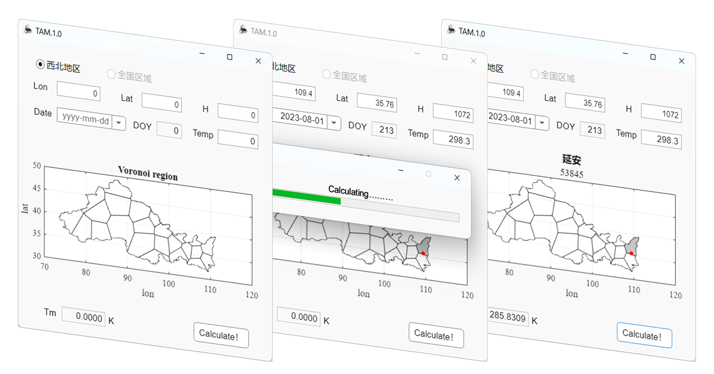

# TAM 大气加权平均温度增强模型

Software specific calculation steps are as follows:

(1) The user only needs to provide the location information, temperature and date of the target, and find the model parameters and surrounding grid points of the Voronoi subregion according to the target location;

(2)The temperature was substituted into the subregion model to obtain the Tm value estimated by the regression model;

(3) According to the location height and date, the Tm of the height of the surrounding grid node is obtained, and the interpolation is made to the location of the target, the high-precision Tm estimated by the TAM model can be obtained.

This model also requires ERA5 data and GGOS data, a total of 11.1G.

Can be downloaded at https://pan.baidu.com/s/1wcNWFnEwKaby21UyFxtj2w

Extract code: TAM1

Put the data in the same folder as the project (data) and it will work

In the future, the scope of service will continue to expand to support the acquisition of national and even global atmospheric weighted average temperature

Acknowledgements: Thanks to ECMWF Center for ERA-5 data, GGOS Atmosphere for grid data and the University of Wyoming, USA for radiosonde data

---------------------------------------------------------------------------------------------

软件具体计算步骤如下：

①用户仅需提供目标所在位置信息、温度及日期，根据目标位置查找其所在Voronoi子区域模型参数及四周格网点；

②将温度代入子区域模型中，获取回归模型所估计的Tm值；

③根据位置高度、日期得到四周格网点在所在高度的Tm，并插值至目标所在位置，即可得到TAM模型所估计的高精度Tm.

本模型还需要ERA5数据、GGOS数据，共计11.1G，

可在https://pan.baidu.com/s/1wcNWFnEwKaby21UyFxtj2w 下载

提取码：TAM1 

将数据放入与项目相同的文件夹（data）即可正常运行

未来将会不断扩大服务范围，以支撑全国乃至全球大气加权平均温度的获取

致谢：感谢ECMWF中心提供的ERA-5资料、GGOS Atmosphere提供的格网数据和美国怀俄明大学提供的探空资料

----------------------------------------------------------------------------------------------

2023.8.20

by  Wang kai  （wangkk318@163.com）
